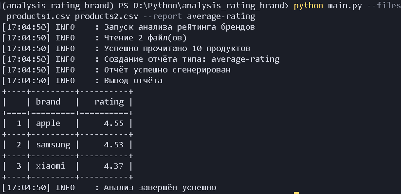
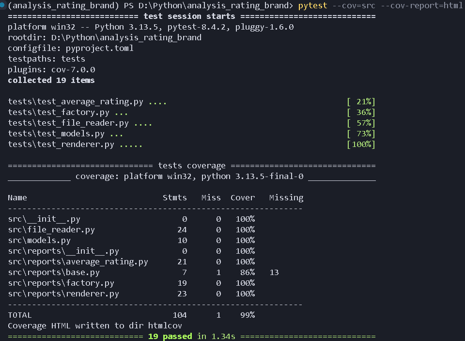

# Analysis Rating Brand
Скрипт для анализа рейтингов товаров и формирования отчётов по брендам.

## Установка

Проект использует `uv` для управления зависимостями:
```bash
# Установка uv (если ещё не установлен)
curl -LsSf https://astral.sh/uv/install.sh | sh

# Создание виртуального окружения и установка зависимостей
uv venv
source .venv/bin/activate  # Linux/Mac
.venv\Scripts\activate  # Windows

```

## Использование
```bash
python main.py --files products1.csv products2.csv --report average-rating
```



### Параметры:
- `--files` - один или несколько CSV файлов с данными о товарах
- `--report` - тип отчёта (доступен: `average-rating`)

### Формат CSV файла:
```csv
name,brand,price,rating
iphone 15 pro,apple,999,4.9
galaxy s23 ultra,samsung,1199,4.8
```

## Примеры запуска
```bash
# Один файл
python main.py --files products1.csv --report average-rating

# Несколько файлов
python main.py --files products1.csv products2.csv --report average-rating
```

## Тестирование
```bash
# Запуск тестов
pytest

# С покрытием кода
pytest --cov=src --cov-report=html
```



## Линтинг
```bash
ruff check .
ruff format .
```

## Добавление нового отчёта

1. Создайте класс отчёта в `src/reports/`, наследуясь от `BaseReport`
2. Реализуйте метод `generate(products)`, возвращающий словарь с `headers` и `rows`
3. Зарегистрируйте отчёт в `src/reports/factory.py`:
```python
from .new_report import NewReport

class ReportFactory:
    _reports = {
        "average-rating": AverageRatingReport,
        "new-report": NewReport,  # Добавьте здесь
    }
```

## Архитектура

- **main.py** - точка входа, обработка аргументов командной строки
- **src/models.py** - модели данных
- **src/file_reader.py** - чтение CSV файлов
- **src/reports/** - модуль отчётов
  - **base.py** - базовый класс отчёта
  - **average_rating.py** - отчёт по среднему рейтингу
  - **factory.py** - фабрика для создания отчётов
  - **renderer.py** - вывод отчётов в консоль
